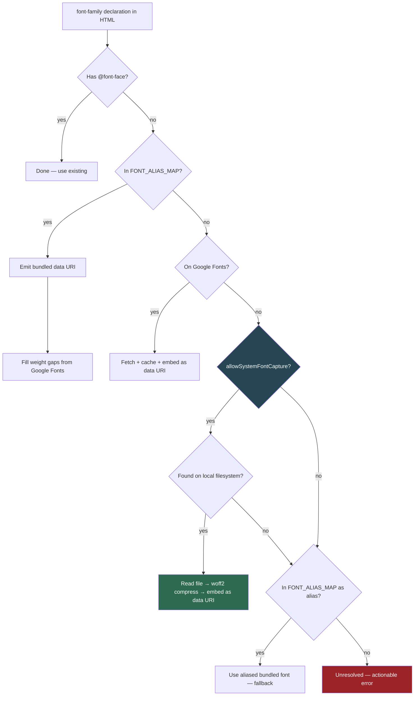

## Summary

Compositions that reference system fonts (SF Mono, Menlo, TT Norms Pro) or fonts hosted on non-Google CDNs currently fall through the deterministic font injector and render with unpredictable fallbacks. The alias map from the prior PR mitigates this for known system fonts, but it's lossy (Inter ≠ SF Pro metrics) and always incomplete. This plan adds a font resolution pipeline that captures the *actual font files* and embeds them, making compositions portable without aliasing. The alias map becomes the fallback for distributed renders where local font access doesn't exist.

---

## Problem Frame

The deterministic font injector resolves fonts through two paths: bundled aliases (18 canonical fonts) and Google Fonts fetch. Anything outside those two paths is unresolved — the font silently falls back at render time. Three categories of fonts hit this gap:

1. **System fonts not in the alias map** — commercial or niche fonts like TT Norms Pro, Frutiger, Proxima Nova that are installed locally but don't exist in Google Fonts and aren't aliased
2. **Fonts hosted on non-Google CDNs** — `<link>` tags pointing to S3, Cloudflare, or custom font servers whose stylesheets are never fetched and inlined by the compiler
3. **Any new system font** — every time Apple, Microsoft, or a Linux distro ships a new system font, the alias map needs a manual update

A font resolution pipeline that captures font files from the local filesystem eliminates categories 1 and 3 entirely. Extending `localizeRemoteFontFaces` to handle external stylesheets (not just @font-face src URLs) eliminates category 2.

---

## Requirements

- R1. The compiler must locate and embed local system font files (ttf/otf/woff2) as data URIs when a font-family isn't resolved by the bundled or Google Fonts paths
- R2. System font location must work on macOS (system_profiler + directory scan), Windows (C:\Windows\Fonts), and Linux (fontconfig fc-match + directory scan)
- R3. Font files must be compressed to woff2 before embedding to keep composition size reasonable (ttf → woff2 is typically 60-70% smaller)
- R4. External `<link rel="stylesheet">` tags pointing to non-Google font CDNs must have their stylesheets fetched, @font-face rules extracted, and font URLs inlined as data URIs
- R5. The resolution order must be: existing @font-face → bundled alias → Google Fonts → local system font → alias fallback → actionable error
- R6. Studio must auto-import system fonts when selected in the picker so the font file is part of the project from composition time (not deferred to render time)
- R7. All existing tests must pass; new tests must cover system font resolution, woff2 conversion, external stylesheet inlining, and the resolution order
- R8. System font capture must be skipped in distributed/Lambda renders (no local filesystem) — the alias map serves as fallback there

---

## Key Technical Decisions

**KTD-1. System font locator lives in `@hyperframes/core` as a shared module.**
Both the compiler (producer) and the Studio API (core) need to locate font files. The Studio API's `GET /fonts` endpoint already scans OS font directories but only returns family names. The new module extends this to return file paths, keyed by normalized family name. The Studio API re-exports it; the producer imports it for the capture step.

**KTD-2. woff2 compression via the `wawoff2` npm package (WASM-based).**
System fonts are typically ttf/otf (500KB-2MB per weight). Embedding raw ttf as data URIs would bloat compositions. `wawoff2` is a WASM port of Google's woff2 reference implementation — works cross-platform without native binaries, supports Node.js and Bun. Alternative considered: shelling out to `woff2_compress` (faster but requires system installation, fails on Lambda). `wawoff2` is the right tradeoff — zero system requirements, ~10ms per font file.

**KTD-3. System font capture is a new Path 3 inside `buildFontFaceCss`, after Google Fonts, before unresolved.**
This ordering ensures bundled fonts (zero-latency, deterministic) and Google Fonts (cached, consistent) take priority. System font capture is the fallback for fonts that can't be found anywhere else. The capture step only runs when `allowSystemFontCapture` is true (set by the compiler but not by distributed render adapters).

**KTD-4. External stylesheet inlining extends `localizeRemoteFontFaces` rather than creating a new pipeline step.**
The function already downloads remote font URLs from @font-face blocks. Extending it to also fetch external `<link rel="stylesheet">` content, extract @font-face rules, and inline their font URLs is a natural extension that keeps font localization in one place. Google Fonts `<link>` tags are excluded (the deterministic injector already handles those).

**KTD-5. Studio auto-import uses the server-side font locator via `GET /fonts/file` API.**
The browser's `window.queryLocalFonts()` API already triggers auto-import for Local-source fonts. For System-source fonts (from `DEFAULT_FONT_FAMILIES`), a new API endpoint `GET /fonts/file?family=<name>` returns the font file binary, which the Studio can then import into the project. This bridges the gap where the browser API is unavailable (Safari, Firefox) or the font isn't in the browser's Local Font Access list.

---

## High-Level Technical Design

---

## Scope Boundaries

### In Scope
- System font locator module (macOS, Windows, Linux)
- woff2 compression integration
- New resolution path in `buildFontFaceCss`
- External stylesheet font inlining in `localizeRemoteFontFaces`
- Studio font file API endpoint
- Studio auto-import for system fonts
- Tests for all of the above

### Out of Scope (Non-Goals)
- Font subsetting (embedding only the glyphs used — separate optimization concern)
- Variable font axis resolution (the capture step embeds the full file as-is)
- CJK font capture (Noto CJK fonts are 15-20MB; embedding them as data URIs is impractical)
- Redistributing commercially licensed fonts in CI artifacts (the capture happens on the author's machine; the composition is a rendering artifact)

### Deferred to Follow-Up Work
- Font file caching across compositions (currently each composition embeds independently)
- Consolidating the four diverging `GENERIC_FAMILIES` sets into one shared module
- Runtime validation that all FONT_ALIAS_MAP values are valid CANONICAL_FONTS keys

---

## Implementation Units

### U1. System font locator module

**Goal:** Create a shared module that locates a font file on the local filesystem given a family name, returning the file path and format.

**Requirements:** R1, R2

**Dependencies:** None

**Files:**
- `packages/core/src/fonts/systemFontLocator.ts` (create)
- `packages/core/src/fonts/systemFontLocator.test.ts` (create)
- `packages/core/package.json` (add subpath export `./fonts/system-locator`)

**Approach:** Extract and extend the directory scanning logic from `packages/core/src/studio-api/routes/fonts.ts`. The existing `fontDirectories()` and `collectFontsFromDir` scan directories and derive family names from filenames. The new module adds:

- A `locateSystemFont(family: string)` function that returns `{ path: string; format: "ttf" | "otf" | "woff2" | "woff" } | null`
- On macOS: first try `system_profiler SPFontsDataType -json` to get authoritative file paths (the JSON includes `path` per typeface), fall back to directory scan
- On Windows: scan `%WINDIR%\Fonts` matching by filename-derived family name
- On Linux: first try `fc-match "<family>" --format="%{file}"` (fontconfig), fall back to directory scan
- Match by normalized family name (case-insensitive, style-suffix-stripped)
- Prefer woff2 > otf > ttf when multiple formats exist for the same family
- Cache results in a module-level Map (same pattern as the Studio API's `cachedFonts`)

**Patterns to follow:** `fontDirectories()` and `collectFontsFromDir` in `packages/core/src/studio-api/routes/fonts.ts`. `normalizeFamilyName` in `deterministicFonts.ts`.

**Test scenarios:**
- `locateSystemFont("Inter")` returns null on a system without Inter installed (or returns a path if installed — test should handle both)
- `locateSystemFont("nonexistent-font-xyz")` returns null
- `locateSystemFont` normalizes case: `"SF MONO"` matches the same as `"SF Mono"`
- On macOS (CI), `locateSystemFont("Helvetica")` returns a valid path under `/System/Library/Fonts/`
- The format detection correctly identifies `.ttf`, `.otf`, and `.woff2` extensions
- Directory scan respects max depth of 2 (matching existing pattern)
- Cache returns the same result on repeated calls without re-scanning

**Verification:** `bun run --cwd packages/core test` passes. Module exports are accessible via `@hyperframes/core/fonts/system-locator`.

---

### U2. woff2 compression capability

**Goal:** Add the ability to compress ttf/otf font files to woff2 format for efficient data URI embedding.

**Requirements:** R3

**Dependencies:** None (independent of U1)

**Files:**
- `packages/producer/package.json` (add `wawoff2` dependency)
- `packages/producer/src/services/fontCompression.ts` (create)
- `packages/producer/src/services/fontCompression.test.ts` (create)

**Approach:** Add the `wawoff2` npm package (WASM-based woff2 compressor). Create a thin wrapper:

- `compressToWoff2(input: Buffer): Promise<Buffer>` — compress a ttf/otf buffer to woff2
- `fontToDataUri(input: Buffer, originalFormat: string): Promise<string>` — compress if needed, then base64 encode as `data:font/woff2;base64,...`
- If the input is already woff2, skip compression and just encode
- Handle compression failures gracefully — fall back to embedding the raw format (`data:font/truetype;base64,...` for ttf) with a console warning

**Patterns to follow:** `fontDataUri()` in `deterministicFonts.ts` for the data URI encoding pattern.

**Test scenarios:**
- `compressToWoff2` accepts a ttf Buffer and returns a smaller woff2 Buffer
- `fontToDataUri` with a ttf input returns a `data:font/woff2;base64,...` string
- `fontToDataUri` with a woff2 input returns a `data:font/woff2;base64,...` string without re-compression
- `fontToDataUri` with an otf input returns a compressed woff2 data URI
- Compression failure falls back to raw format data URI with a warning

**Verification:** `bun run --cwd packages/producer test` passes. `wawoff2` is listed in dependencies.

---

### U3. System font resolution in buildFontFaceCss

**Goal:** Add a new resolution path that locates and embeds local system fonts when the bundled and Google Fonts paths fail.

**Requirements:** R1, R5, R8

**Dependencies:** U1, U2

**Files:**
- `packages/producer/src/services/deterministicFonts.ts` (modify `buildFontFaceCss` and `injectDeterministicFontFaces`)
- `packages/producer/src/services/deterministicFonts.test.ts` (extend)

**Approach:** Add a Path 3 inside `buildFontFaceCss`, after the Google Fonts fetch (Path 2) returns empty:

1. Check `options.allowSystemFontCapture` — if false (distributed render), skip to unresolved
2. Call `locateSystemFont(originalCaseFamily)` from the system font locator
3. If found: read the font file, call `fontToDataUri` to compress and encode, emit a single `@font-face` rule with the data URI
4. If not found: fall through to unresolved (existing behavior)

Add `allowSystemFontCapture: boolean` to `InjectDeterministicFontFacesOptions`. Default to `true` in `compileForRender` (local renders). Set to `false` in distributed render adapters (`packages/producer/src/services/render/` and `packages/aws-lambda/`).

**Patterns to follow:** The Google Fonts fetch path in `buildFontFaceCss` (Path 2). The `buildFontFaceRule` helper for emitting @font-face CSS.

**Test scenarios:**
- With `allowSystemFontCapture: true` and a font that exists on the local system, the function emits a @font-face rule with a data URI
- With `allowSystemFontCapture: false`, the system font path is skipped even if the font exists locally
- A font already covered by @font-face is not re-captured
- A font in FONT_ALIAS_MAP is resolved via the alias, not via system capture
- A font available on Google Fonts is resolved via Google, not via system capture
- A font not found anywhere (not aliased, not on Google, not on system) is added to the unresolved list
- The emitted @font-face rule has `font-display: block` (matching existing rules)
- The resolution order is verified: alias → Google → system → unresolved

**Verification:** `bun run --cwd packages/producer test` passes. Render a composition referencing a local-only font and confirm the @font-face rule appears in the compiled output.

---

### U4. External stylesheet font inlining

**Goal:** Fetch non-Google external `<link rel="stylesheet">` content, extract @font-face rules, and inline their font URLs as data URIs.

**Requirements:** R4

**Dependencies:** None (independent of U1-U3)

**Files:**
- `packages/producer/src/services/htmlCompiler.ts` (modify `localizeRemoteFontFaces`)
- `packages/producer/src/services/htmlCompiler.test.ts` (extend)

**Approach:** Extend `localizeRemoteFontFaces` to also handle external stylesheet `<link>` tags:

1. Before the existing @font-face URL scan, find all `<link rel="stylesheet" href="https://...">` tags in the HTML
2. Exclude Google Fonts URLs (already handled by the deterministic injector)
3. Fetch each external stylesheet's CSS content
4. Extract @font-face blocks from the fetched CSS
5. For each @font-face block, download the woff2/ttf URLs referenced in `src: url(...)`
6. Rewrite the CSS with local paths (same as existing behavior for @font-face URLs)
7. Inject the fetched @font-face rules into the HTML as a `<style>` block, replacing the `<link>` tag
8. Handle fetch failures gracefully — keep the `<link>` tag if the stylesheet can't be fetched (network access at render time is the fallback)

**Patterns to follow:** The existing `downloadAndRewriteUrls` helper. The `REMOTE_FONTFACE_URL_RE` pattern for extracting URLs from @font-face blocks.

**Test scenarios:**
- A `<link>` tag pointing to a non-Google font CDN is fetched, its @font-face rules are extracted, and font URLs are inlined
- A `<link>` tag pointing to Google Fonts is left untouched (handled by deterministic injector)
- A `<link>` tag that fails to fetch is kept in the HTML with a console warning
- Multiple `<link>` tags are processed independently
- The `<link>` tag is replaced with a `<style>` block containing the inlined @font-face rules
- Non-font `<link>` tags (rel="icon", rel="preconnect") are not touched

**Verification:** `bun run --cwd packages/producer test` passes. A composition with a `<link>` tag to a non-Google font CDN produces inlined @font-face rules in the compiled output.

---

### U5. Studio font file API and auto-import

**Goal:** Add a server-side API endpoint that returns font file binary data, and wire Studio's font picker to auto-import system fonts on selection.

**Requirements:** R6

**Dependencies:** U1 (needs system font locator)

**Files:**
- `packages/core/src/studio-api/routes/fonts.ts` (add `GET /fonts/file` route)
- `packages/studio/src/components/editor/propertyPanelFont.tsx` (modify `commitFamily` for System-source fonts)
- `packages/studio/src/components/editor/propertyPanelHelpers.ts` (no change expected)

**Approach:**

Server side: Add `GET /fonts/file?family=<name>` route that:
1. Calls `locateSystemFont(family)` from the shared locator module
2. If found: reads the file and returns it with appropriate Content-Type (`font/ttf`, `font/otf`, `font/woff2`) and Content-Disposition header
3. If not found: returns 404

Client side: In `commitFamily`, when `option.source === "System"` and the font is not a CSS generic (sans-serif, monospace, etc.):
1. Fetch `GET /fonts/file?family=<family>`
2. If the response is OK: create a File object from the blob, pass to `onImportFonts([file])`, inject the @font-face stylesheet
3. If 404 or error: fall through to existing behavior (just commit the font-family name)

This means system fonts selected in Studio become project-embedded files — the composition is self-contained before it ever reaches the compiler.

**Patterns to follow:** The existing `GET /fonts` and `GET /fonts/google` routes. The `importLocalFont` function in `propertyPanelFont.tsx` for the client-side import flow.

**Test scenarios:**
- `GET /fonts/file?family=Helvetica` returns a font file with correct Content-Type on macOS
- `GET /fonts/file?family=nonexistent` returns 404
- `GET /fonts/file` without a family parameter returns 400
- Studio: selecting a System-source font triggers a fetch to `/fonts/file` and imports the result
- Studio: selecting a System-source font that returns 404 falls through to commit the name directly
- Studio: selecting a CSS generic (sans-serif) does not trigger the font file fetch

**Verification:** `bun run build` succeeds. Studio font picker auto-imports system fonts on selection (manual verification).

---

## Risks & Dependencies

- **woff2 compression adds ~2MB to the producer package** (WASM binary). Acceptable for a build-time tool.
- **System font file paths vary by OS and version.** The locator uses multiple strategies (system_profiler, fontconfig, directory scan) to maximize coverage, but some fonts in unusual locations may not be found.
- **Font licensing** — system fonts like SF Pro are licensed for use on Apple platforms. Embedding them in a video composition (a static artifact rendered on the author's machine) is standard fair use, but the capture step should not redistribute font files to other machines. The `allowSystemFontCapture: false` flag in distributed renders prevents this.
- **Large font files** — some fonts (especially CJK families) are 15-20MB. CJK fonts are explicitly out of scope; a size cap (e.g., 5MB per font file) should be enforced to prevent accidentally embedding oversized files.

---

## Sources & Research

- `packages/core/src/studio-api/routes/fonts.ts` — existing OS font directory scanning
- `packages/cli/src/capture/fontMetadataExtractor.ts` — fontkit-based font metadata extraction
- `packages/producer/src/services/deterministicFonts.ts` — `injectDeterministicFontFaces` and `buildFontFaceCss` resolution pipeline
- `packages/producer/src/services/htmlCompiler.ts` — `localizeRemoteFontFaces`, `promoteCssImportsToLinkTags`, `compileForRender` font operation sequence
- `packages/studio/src/components/editor/propertyPanelFont.tsx` — Studio font picker with Local/System/Google sources
- `wawoff2` npm package — WASM-based woff2 compression, cross-platform, no native dependencies
